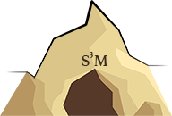

# S3M &mdash; Statistically Significant Shapelet Mining

This is the implementation of the method described in the ISMB 2018
paper &ldquo;Association Mapping in Biomedical Time Series via
Statistically Significant Shapelet Mining&rdquo;.

# Installation

For Mac OS X, we recommend installing S3M using the [`Homebrew` package
manager](https://brew.sh):

    $ brew install BorgwardtLab/mlcb/s3m

For Debian and Ubuntu, please use one of the released `.deb` files and
install it using:

    $ sudo apt install s3m-latest.deb

For Arch Linux, please install S3M from [AUR](https://aur.archlinux.org/packages/s3m-git)
using `pacaur`, for example:

    $ pacaur -S s3m

Please refer to the [advanced build instructions](docs/advanced_build.md)
for more advanced build processes, including source builds and Docker
installations.

# Example

We provide a synthetic data set that illustrates the utility of S3M. After installation, the command 

    $ s3m -i data/example/synthetic.csv -m 15 -o results/example.json -n 
 
runs S3M on it for shapelets of length `15` and stores its results in the `results` folder. The below figure shows how the method identifies the case-characteristic two spikes as the most significant shapelet (p-Value: 5.42e-20).

# Help

If you have questions concerning S3M or you encounter problems when
trying to build the tool under your own system, please open an issue in
[the issue tracker](https://github.com/BorgwardtLab/S3M/issues). Try to
describe the issue in sufficient detail in order to make it possible for
us to help you.

# Contributors

S3M is developed and maintained by members of the [Machine Learning and
Computational Biology Lab](https://www.bsse.ethz.ch/mlcb) of [Prof. Dr.
Karsten Borgwardt](https://www.bsse.ethz.ch/mlcb/karsten.html):

- Christian Bock ([GitHub](https://github.com/chrisby))
- Thomas Gumbsch ([GitHub](https://github.com/tgumbsch))
- Max Horn ([GitHub](https://github.com/maexlich))
- Michael Moor ([GitHub](https://github.com/mi92))
- Bastian Rieck ([GitHub](https://github.com/Submanifold))
