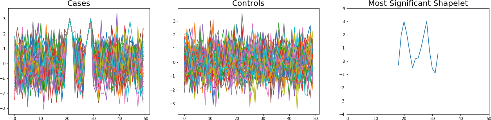

# S3M &mdash; Statistically Significant Shapelet Mining

This is the implementation of the method described in the ISMB 2018 paper "Statistically Significant Shapelet Mining in Biomedical Time Series".

# Building

S3M has been built successfully under various Linux distributions as
well as under Mac OS X. The tool is written in C++ and requires the
following dependencies:

* A C++ compiler with support for C++11; please refer to [this table](https://en.cppreference.com/w/cpp/compiler_support)
  in order to find a suitable compiler
* The [`CMake`](https://cmake.org) build system for building the tool
* The [`Boost`](http://www.boost.org) libraries&nbsp;(technically, only a subset
  of them) for statistical calculations

How to install these dependencies depends on your flavour of operating system.
For most Linux distributions, a package manager is available, so that variants
of the following commands should be sufficient:

    $ apt-get install cmake libboost-all-dev build-essential # For Ubuntu
    $ pacman -S boost cmake gcc                              # For Arch Linux

For Mac OS X, we recommend installing the [`Homebrew` package manager](https://brew.sh). Afterwards,
the required dependencies can be installed via:

    $ brew install boost cmake llvm

After cloning the repository and navigating to the repository folder in
a terminal, please follow these steps to build the software:

    # This assumes that you have cloned the repository to some folder and
    # navigated to the folder via your terminal application.
    $ mkdir build
    $ cd build
    $ cmake ../code/cpp/
    -- The CXX compiler identification is AppleClang 9.0.0.9000039
    -- Check for working CXX compiler: /Applications/Xcode.app/Contents/Developer/Toolchains/XcodeDefault.xctoolchain/usr/bin/c++
    -- Check for working CXX compiler: /Applications/Xcode.app/Contents/Developer/Toolchains/XcodeDefault.xctoolchain/usr/bin/c++ -- works
    -- Detecting CXX compiler ABI info
    -- Detecting CXX compiler ABI info - done
    -- Detecting CXX compile features
    -- Detecting CXX compile features - done
    -- CMAKE_ROOT:           /usr/local/Cellar/cmake/3.10.2/share/cmake
    -- CMAKE_SYSTEM_VERSION: 17.4.0
    [...]
    $ make

The `build` directory should now contain the `s3m` executable.

## Building with Docker

In order to ease the usage of s3m accross multiple platforms, we provide a script to setup a docker contrainer contraining s3m.

To build the binaries using dock execute the following commands in the root folder of the repository

    $ docker build -t s3m_container .

This creates a new docker container with the tag `s3m_container`, such that s3m can be called using the following command

    $ docker run -t s3m_container s3m --help
    Available options:
      -h [ --help ]                 Show help
      --standardize                 Standardize data
      -a [ --all ]                  Report all shapelets, not just the most
                                    significant ones
      -t [ --merge-tables ]         Merge equal contingency tables
      -n [ --keep-normal-only ]     Keep only normal p-values
      -p [ --disable-pruning ]      Disable pruning criterion
      -r [ --remove-duplicates ]    Remove duplicates
      -m [ --min-length ] arg (=10) Minimum candidate pattern length
      -M [ --max-length ] arg (=0)  Maximum candidate pattern length
      -s [ --stride ] arg (=1)      Stride
      -l [ --label-index ] arg (=0) Index of label in time series
      -k [ --keep ] arg (=0)        Maximum number of shapelets to keep (0 =
                                    unlimited
      -i [ --input ] arg            Training file
      -o [ --output ] arg           Output file (specify '-' for stdout)

which runs `s3m --help` in the docker container.

To map a directory (for example containing data and/or results) into the docker contrainer, one must rely on the docker maping syntax

    $ docker run -it -v $PWD/data:/S3M/data -t s3m_container bash
    

which maps the directory `$PWD/data` into the container under the path `/S3M/data/`.

To ease usage, it is possible to define an alias using `alias s3m_container="docker run -it -v $(pwd)/data:/S3M/data -v $(pwd)/results:/S3M/results -t s3m_container"`.

This allows to run s3m and the python analysis scripts using:

    $ s3m_container s3m --help
    $ s3m_container ShapeletEvaluation.py --help 

Please be aware that this requires the data to be in the data folder of the repository. Access to the files in this folder has to be done under the path `/S3M/data`, while the results should be written to `/S3M/results` which allows them to be accesed on the host computer in the results folder of the repository.

# Example

We provide a synthetic data set that illustrates the utility of S3M. After installation, the command `s3m -i data/example/synthetic.csv -m 15 -o results/example.json -n` runs S3M on in and stores its results in the `results` folder. The below figure shows how the method identifies the case-characteristic two spikes as the most significant shapelet.

# Help

If you have questions concerning S3M or you encounter problems when
trying to build the tool under your own system, please open an issue in
[the issue tracker](https://github.com/BorgwardtLab/S3M/issues). Try to
describe the issue in sufficient detail in order to make it possible for
us to help you.

# Contributors

S3M is developed and maintained by members of the [Machine Learning and
Computational Biology Lab](https://www.bsse.ethz.ch/mlcb) of [Prof. Dr.
Karsten Borgwardt](https://www.bsse.ethz.ch/mlcb/karsten.html):

- Christian Bock ([GitHub](https://github.com/chrisby))
- Thomas Gumbsch ([GitHub](https://github.com/tgumbsch))
- Michael Moor ([GitHub](https://github.com/mi92))
- Bastian Rieck ([GitHub](https://github.com/Submanifold))
